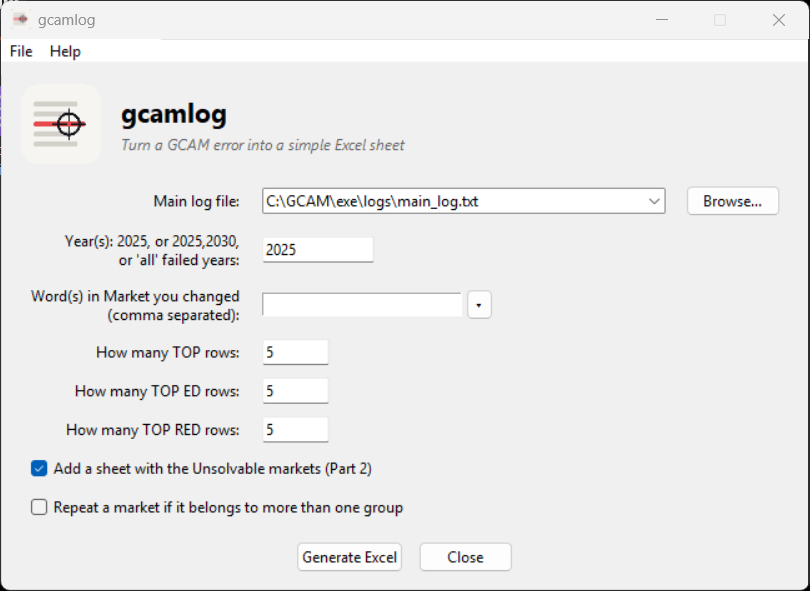
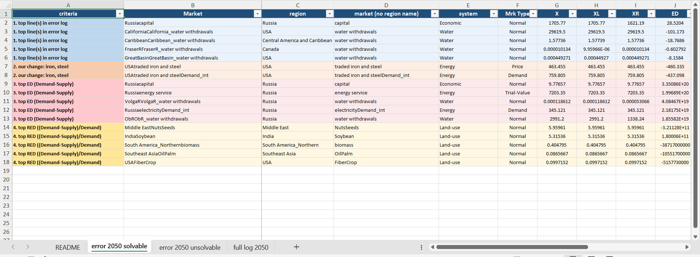

# gcamlog


**Turn a [GCAM](https://github.com/JGCRI/gcam-core) "did not solve" log into a simple Excel
sheet** that points straight at the markets causing the failure.

When GCAM fails to solve a period it prints hundreds of unsolved markets into the log.
Most of them are noise (supply and demand already almost match). gcamlog pulls out
**only the rows that matter**, groups them by *why* they matter, and colour-codes them, so
you can hand a colleague one clean sheet instead of a 30,000-line log.



## Two ways to run it

1. **Download the app from the [Releases page](../../releases)** and double-click it - nothing to
   install; Python is bundled inside. *Easiest.*
   * **Windows**: `gcamlog-windows.exe`
   * **macOS**: `gcamlog-macos.zip` (unzip, then **right-click the app > Open** the first time)
2. **Run the script**: `python gcamlog.py`. Needs Python 3.9+ and `openpyxl`.

Both open the same small window and produce the same Excel. Details for each are below.

## Contents

| item | description |
| --- | --- |
| `gcamlog.py` | the source code; both apps are built from this one file |
| `data/gcam_regions.csv` | editable map: market prefix → GCAM region (32 regions, water basins, GCAM-USA states) |
| `data/gcam_systems.csv` | editable map: keyword → GCAM system |
| `assets/` | the app icon, logo and screenshots |
| `sample/` | the 2050 errors of a real failed run - try the app on it |
| `build_exe.bat` | rebuilds the Windows app locally |
| `.github/workflows/` | builds the Windows and macOS apps on every version tag |
| `README.md` · `LICENSE` · `requirements.txt` | this guide, the MIT license, the Python dependencies |

The app reads the CSV files in `data/` first, so if you edit them the change takes effect on the
next run (no rebuild). A bundled copy inside the app is used only if the `data/` file is missing.

## Output



A single Excel file: one **README** sheet, then **three sheets for each year** you ask for (you can
request one year or several, e.g. `2025,2030`). The file is named
`gcamlog_<scenario>_<yyyymmdd-hhmm>_<year(s)>.xlsx` (scenario and run time come from the log). The
three per-year sheets are:

### 1) `README` sheet
A short table explaining every column (`Market, Mrk Type, X, XL, XR, ED, EDL, EDR, RED, brk,
Supply, Demand`), plus a quick ED vs RED note.

### 2) `error <year> solvable` sheet (the main one)
The **GCAM log columns**, reordered for reading, plus a `criteria` column at the front (why the row is
here) and three helper columns split from the market name: **`region`** (one of GCAM's 32 regions;
for water it is the region the basin belongs to), **`market (no region name)`** (the market name with
the region stripped off), and **`system`** (GCAM's systems). The region and system maps are the
editable CSV files `data/gcam_regions.csv` and `data/gcam_systems.csv`. Rows are grouped and
colour-coded:

| criteria | colour | what it is |
| --- | --- | --- |
| **1. top line(s) in error log** | blue | the first row(s) GCAM printed (you choose how many) |
| **2. our change: …** | orange | every market whose name contains the word(s) you searched (e.g. `iron`, `steel`) |
| **3. top ED** | red | the largest `ED = Demand-Supply` (biggest absolute gaps) |
| **4. top RED** | yellow | the largest `RED = (Demand-Supply)/Demand`, GCAM's convergence score |

By default a market is shown **once**, under its lowest-numbered group, and tagged if it also
belongs to others, e.g. `2. our change: iron (also in 3)`. Tick **"Repeat a market"** to instead
show it once in every group it belongs to.

### 3) `error <year> unsolvable` sheet (optional, checkbox)
GCAM splits unsolved markets into **Part 1: Solvable** and **Part 2: Unsolvable Markets Not
Cleared**. This sheet applies the **same criteria filter** as the solvable sheet
to the Part 2 markets (same columns, same colours, same window settings), so you get the important
unsolvable ones instead of a huge list. Tick or untick the checkbox to include it.

### 4) `full log <year>` sheet
The **entire year's errors**: every market that did not clear (Part 1 **and** Part 2), raw, with
**no criteria filtering**. A `part` column (green = solvable, red = unsolvable) shows where each row
came from. This is just a clean, organized view of the whole log for that year.

### ED vs RED (quick reminder)

* **ED** = `Demand-Supply`: the absolute gap, in that market's own units.
* **RED** = `(Demand-Supply)/Demand`, the relative gap. GCAM solves a market when `|RED| < 0.001`.
  RED is the referee, but it can look very large when demand is near zero, so always read Supply and Demand too.

## Option 1: the app (easiest)

1. **Double-click the app** (it can live anywhere). A small window opens.
2. Pick the log (recent logs are remembered), type the word(s) you changed (e.g. `iron,steel`),
   pick the year (e.g. `2025`), set how many rows you want, then press **Generate Excel**.
3. The file is written next to the log and opens automatically.

> **Windows SmartScreen** may warn on first run because the app is not code-signed.
> Click **More info**, then **Run anyway**. (It only reads a text log and writes an Excel file.)
>
> **macOS Gatekeeper**: the first time, **right-click the app > Open > Open** (a normal double-click
> may be blocked because the app is not notarized). If macOS still refuses, allow it under
> **System Settings > Privacy & Security > Open Anyway**.

## Option 2: run the script

Needs **Python 3.9+**.

```bash
pip install -r requirements.txt
python gcamlog.py
```

Headless (no popup), for scripting. Args are `log year words n_first n_ed n_red show_unsolvable repeat`:

```bash
python gcamlog.py "<log>" 2025 iron,steel 1 15 15 1 0
```

## Build the .exe yourself

You need **Python 3.9+** installed first (that is the only prerequisite). Then, in this folder:

```bash
pip install pyinstaller openpyxl
pyinstaller --onefile --windowed --name gcamlog --icon assets\gcamlog.ico --add-data "assets\gcamlog.ico;assets" --add-data "assets\gcamlog.png;assets" --add-data "data\gcam_regions.csv;data" --add-data "data\gcam_systems.csv;data" gcamlog.py
```

* `--onefile` bundles Python and the libraries into one `.exe` (nothing to install on the target PC).
* `--windowed` hides the black console window (this is a GUI app).

Easiest of all: just **double-click `build_exe.bat`**. It installs what it needs and puts a fresh
`gcamlog.exe` in this folder.

The repository also builds **both the Windows and macOS apps automatically**: pushing a version tag
(e.g. `v1.0.0`) runs `.github/workflows/release.yml` on GitHub's own Windows and Mac machines and
attaches `gcamlog-windows.exe` and `gcamlog-macos.zip` to a new release.

## License

MIT, see [LICENSE](LICENSE).
